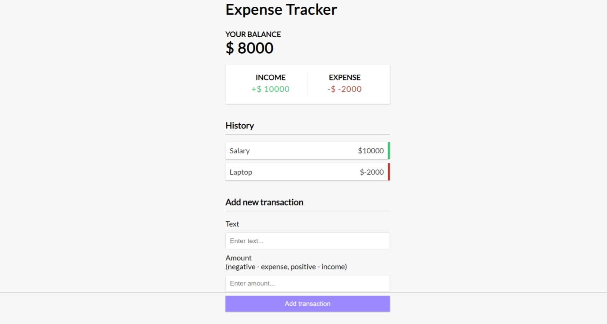

# Expense Tracker App

## Overview

The **Expense Tracker App** is a web application designed to help users manage and track their expenses in simple way. This application allows users to easily add, remove, and view their expenses, providing insights into their spending habits and helping them stay on top of their financial goals.

## Features

- **Add Income**: Allows users to input and save income entries to track their earnings.
- **Add Expense**: Enables users to enter and record expenses to monitor their spending.
- **Show Income and Expense**: Displays a summary of all income and expense entries, providing an overview of the user's financial status.
- **Remove Entries**: Provides the ability to delete specific income or expense entries from the record.

## Installation

To get started with the **Image Upload Services App**, follow these steps:

1. **Clone the repository:**

    ```bash
    git clone https://github.com/muhammadderic/expense-tracker-app.git
    cd expense-tracker-app
    cd frontend
    ```

2. **Install dependencies:**

    ```bash
    npm install
    ```

3. **Run the development server:**

    ```bash
    npm run dev
    ```

    Visit [http://localhost:3000](http://localhost:3000) in your browser to see the app in action.

## Screenshots

<div style="display: flex; justify-content: space-between;">
    
</div>

## Technologies Used

- **Vue.js** - A progressive JavaScript framework for building user interfaces and single-page applications.
- **Vue-Toastification** - A library for displaying toast notifications in Vue.js applications.

## Contact

If you have any questions or suggestions, feel free to reach out:

- **GitHub**: [muhammadderic](https://github.com/muhammadderic)
